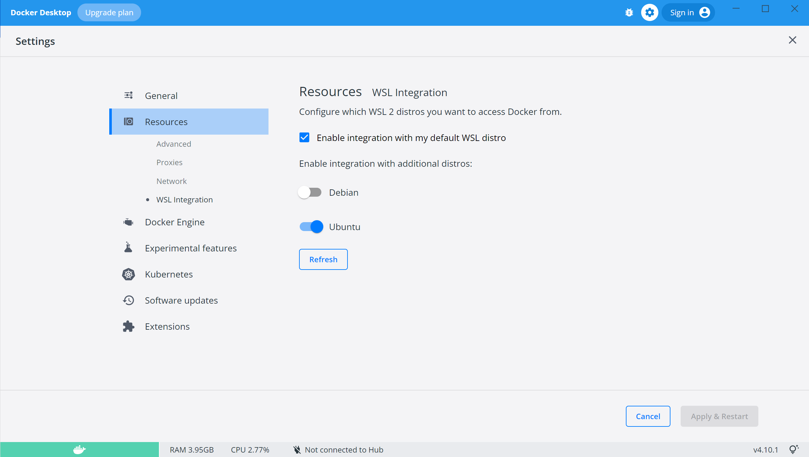

# MacMedia
MacMedia Media Library Tracker

# Development

A virtual environment should be set up with the imports defined in the *requirements.txt* file.
Additionally it is helpful to install `gunicorn` to run the Flask application under this
server to mimic the Azure deployed server environment.

## Developer Linting

[Flake8](https://flake8.pycqa.org/en/latest/) is utilized to enforce code style with a couple of 
flags turned off as defined in the *setup.cfg* file. Linting can be invoke as:
```
    make lint
```

## Developer Testing

[pytest](https://docs.pytest.org/en/7.1.x/) is utilized as the test runner for MacMedia test cases. Test
cases are defined under the *tests* directory. Data required for test cases is stored in *tests/data*.
Test case execution can be invoked as:
```
    make test
```

Additionally, [pytest-cov](https://pytest-cov.readthedocs.io/en/latest/) is utilized to generate test case
coverage statistics. The html report is stored under *apps/docs/htmlcov*. It can be invoked with a browser 
display of the results after running using:
```
    make coverage
```

If you just want a terminal text display of test case coverage, use the same target as used in the CI pipeline:
```
    make coverage-ci
```

## Development Deployment Environment

For running the application, Docker containers are used. Docker Desktop should be installed and
configured to use WSL 2. For example, in this case, the configuration is for Ubuntu:


The application can be built into a docker image using the included `Dockerfile`. The image can be created
and launched using the `Makefile` targets:
```
    make build
    make run-dev
```
The running application in the Docker container can then be accessed at the url __http://localhost:5000/main__.
`make run-dev` essentially runs the below which you could also run in a terminal:
```
    docker run -p 5000:5000 --env FLASK_ENV=development macmedia:latest
```

## Github Workflows

Upon a push to master, linting, code style checking, code coverage (which invokes the test cases), and security issues
will all be checked.  is used to check for
security issues in the code.

---

# Documentation

Sphinx and reStructuredText are utilized to create developer originated documentation.
The __.rst__ files are located under the `app/docs` directory. A top level `Makefile` is
used to generate the documentation with the command:
```
    make docs
```
The root of the resulting html documentation is `app/docs/_build/html/index.html`.
